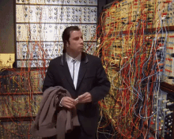

<h1 align="center">Hi, I'm Rafael</h1>

  

    - Studying Electrical and Computer Engineering at <a href="https://www.uc.pt" target="_blank">Coimbra University</a>
  

  
  

    
  

<h3 align="left">Connect with me:</h3>

  

<h3 align="left">Languages and Tools:</h3>

 
   
  <!-- Other tools and languages -->

  

